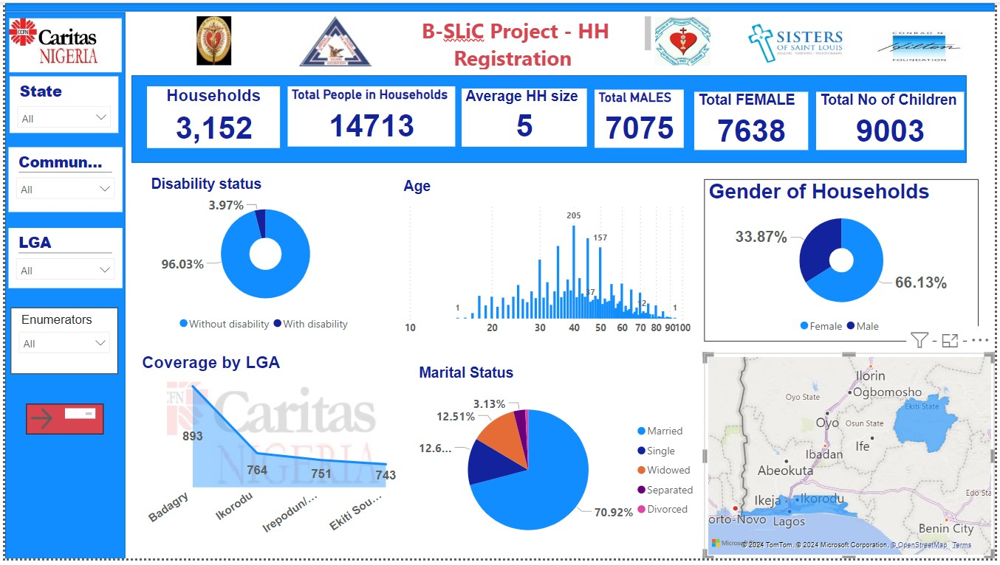
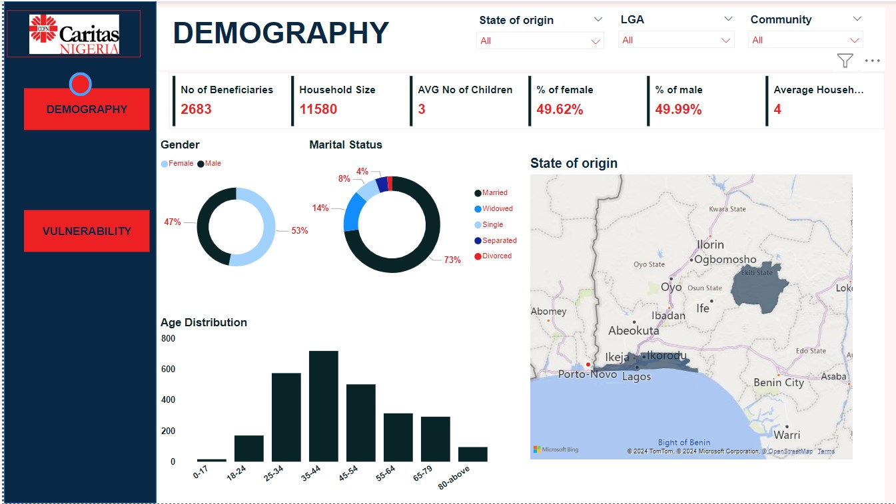
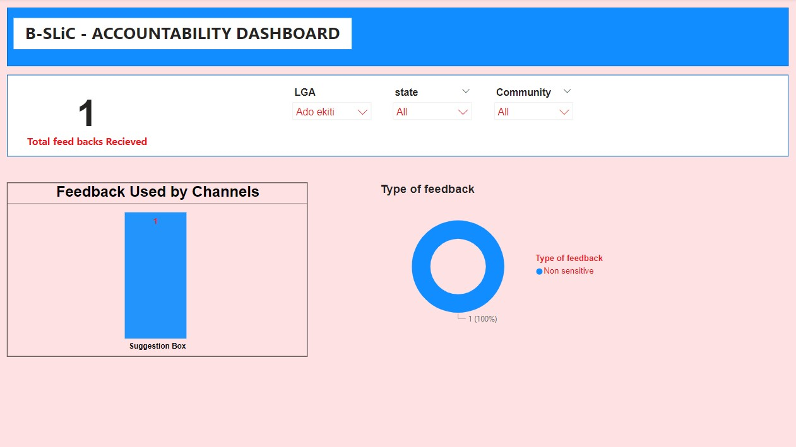

<!--Section 1: Introduce yourself -->
## ABOUT ME

Hello! I’m Aondofa Isaac Ahua 🤓, a results-oriented Data Analyst with over 8 years of experience in data management and analytics. I utilize skills in Excel, generative AI, computer ethics, Power BI automation, and Kobo Collect to clean, analyze, and visualize data for decision-making. I also have experience in designing MEAL frameworks and developing indicators for performance tracking.

<!--Mention your top/relevant skills here - core and soft skills-->
## SKILLS

*As the senior MEAL Associate with Caritas Nigeria on the B-SLiC project, I oversee project monitoring, evaluation, accountability and learning.*

**- ✅ Project Monitoring and Evaluation (M&E) Expertise.**
I provide comprehensive mentorship to team members, enhancing their understanding of M&E methodologies and equipping them to design and implement effective M&E frameworks. I develop and disseminate tailored tools and guidance documents, enabling the team to track project progress, measure impact, and drive data-informed decision-making. 

**- ✅ Data wrangling and visualization.**
I conduct in-depth data analysis and visualization to monitor project progress against outcomes. I design and develop models and dashboards to track on-site monitoring activities, providing actionable insights that inform decision-making and drive project success. 

**- ✅ Project database building, maintenance and communication.**
I design, develop, and maintain a range of project tools, including questionnaires (Household Registration, Needs Assessment, Post-Distribution, and Market Assessment) and project management tools (IPTT, Issue Log, MOV Tracker, and Risk Register). I utilize digital platforms such as Kobo Collect Server, and Microsoft Office Suites (Excel, OneDrive, Power BI), to ensure data security and integrity. I effectively communicate updates and changes to diverse stakeholders, promoting transparency and collaboration throughout the project lifecycle.

**- ✅ Project Fieldwork and Problem-Solving Situations.**

**_I am continuously conducting the following fieldwork_**
Household surveys and focus group discussions to gather data on project outcomes. Observing and documenting project activities, such as distributions, trainings, and community events. Collecting and analyzing data on project indicators, such as beneficiary numbers, service delivery, and outcome metrics. Conducting market assessments and price monitoring to inform project interventions. And collaborating with community leaders, local authorities, and other stakeholders to gather insights and feedback on project implementation.

**_Problem-Solving Situations_**
Identifying and addressing data discrepancies, inconsistencies, or inaccuracies that affect project reporting and decision-making. Overcoming logistical obstacles, such as transportation issues or security concerns, that hinder fieldwork and data collection by planning early and making emergency plans. Addressing community concerns, rumours, or misconceptions that may impact project acceptance and participation. Troubleshooting technical issues with data collection tools to ensure smooth data collection and transmission. Managing stakeholder expectations and competing demands from donors, government officials, and community leaders.

<!--Section 2: List 3-4 key projects-->
## MY PROJECTS

*A look at some of the projects I've been working on.*

**Successfully cleaned, transformed, and visualized B-SLiC project registration data to display real-time data collection progress and summarize its KPIs easily.**

B-SLiC project 2024 Household registration is the first of its kind in from Caritas Nigeria in southwest Nigeria, this  was key in the development and Humanitarian project......

[Read More](https://ccfng1.sharepoint.com/:u:/s/EKITI_MEAL_TEAM/EYTt6ej9hIVLuNXZ4Mw94xQBiRr6XpRvpo2D7USUnBnocg?e=psQ2tD)

**2023 Baseline evaluation dashboard for B-SLiC project.**

The project started in 2022 August and this was its first assessment of the project communities........ 

[Read More](https://ccfng1.sharepoint.com/:u:/s/EKITI_MEAL_TEAM/EbW9wsUMNHhJnw5nNsMmHQYBy73FaCTlPtIT-9xs2xkg1A?e=ksTjiU)

**Project Accountability Dashboard for tracking of feedback and performance of channels in the communities**

TO maintain **"Do No Harm Principle for Safeguarding Project Interventions"** it is crucial that the mechanism is strengthened for.... 

<a href="PSEAH.pdf">View the training questions on PSEAH here (pdf file)</a>

## CONTACT DETAILS

*Let’s connect and see how we can make a difference together!*
<table>
  <tbody>
    <tr>
      <td>📧</td>
      <td><a href="mailto:aondofaahua@gmail.com">aondofaahua@gmail.com</a></td>
    </tr>
    <tr>
      <td>📞</td>
      <td>(234) 703-281-7801</td>
    </tr>
    <tr>
      <td>📍</td>
      <td>Ekiti, Nigeria</td>
    </tr>
    <tr>
      <td>⬇️</td>
      <td><a href="Ahua Isaac CV_08_12_2024.pdf">Download my CV</a></td>
    </tr>
    <tr>
      <td>🌐</td>
      <td><a href="https://linkedin.com/in/aija4real">My Certifications and more on LinkedIn</a></td>
    </tr>
    <tr>
      <td>📺</td>
      <td><a href="https://www.youtube.com/@aondofaisaacahua6456">Begining a new YouTube channel</a></td>
    </tr>
  </tbody>
</table>
