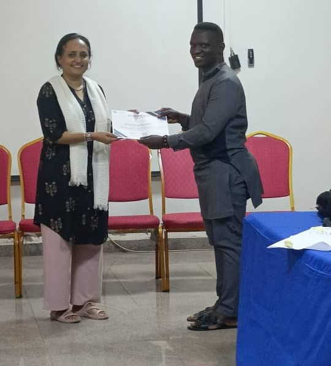

<!--Section 1: About-->
<h1 align="center">Aondofa Isaac Ahua</h1>

Senior MEAL Associate | Data Analytics & Evidence-Informed Programming

  
  
  

---

## ABOUT ME

I am a Senior MEAL Associate with 11+ years of experience designing and managing MEL frameworks, data systems, and results-based management processes across public health, agriculture, and livelihoods programs. I have led over 60-person cross-functional field teams to register and verify over 25,000 households across 8 LGAs, and built automated Power BI dashboards integrating KoboToolbox via Power Query M-code for real-time performance tracking. I work with Excel, Power Query, Power BI, KoboToolbox, and OpenMRS to manage data end-to-end, from collection to reporting, and I design logframes and indicators that hold projects accountable to results.

📜 *Certificate of Competency in Results-Based Monitoring and Evaluation, for evidence-informed programming (2025)*

---

## SKILLS

As Senior MEAL Associate with Caritas Nigeria on the B-SLiC project, I lead the project's monitoring, evaluation, accountability, and learning function.

**Project Monitoring and Evaluation**
I mentor team members on M&E methodologies and support them to design and apply effective M&E frameworks. I develop tools and guidance documents that help the team track project progress, measure results, and inform data-driven decisions.

**Data Wrangling and Visualization**
I analyze and visualize project data to monitor progress against outcomes. I build models and dashboards for on-site monitoring activities, providing insights that support decision-making.

**Database Building, Maintenance and Communication**
I design and maintain project tools, including Household Registration, Needs Assessment, Post-Distribution, and Market Assessment questionnaires, as well as management tools such as the IPTT, Issue Log, MOV Tracker, and Risk Register. I use Kobo Collect Server and Microsoft Office (Excel, OneDrive, Power BI) to maintain data security and integrity, and communicate updates clearly to stakeholders.

**Fieldwork and Problem-Solving**

*Fieldwork:*
Household surveys and focus group discussions on project outcomes. Observation and documentation of distributions, trainings, and community events. Data collection and analysis on project indicators, including participant numbers and service delivery. Market assessments and price monitoring. Engagement with community leaders and local authorities to gather feedback on implementation.

*Problem-Solving:*
Identifying and resolving data discrepancies that affect reporting and decisions. Planning around logistical and security constraints that affect fieldwork. Addressing community concerns or misconceptions about project activities. Troubleshooting data collection tools to keep data transmission running smoothly. Managing expectations across donors, government officials, and community stakeholders.

---

## TOOLS & TECHNOLOGY

**MEL Frameworks:** Logical Framework (Logframe), Theory of Change, Results-Based Management, IPTT

**Data Platforms:** KoboToolbox (Advanced XLSForm), Power BI, Power Query (M-code), REDCap, ODK, OpenMRS, NMRS

**Productivity Suites:** Microsoft 365 (SharePoint, Teams), Google Workspace

**Data Quality:** Data Quality Assurance (DQA), Data Triangulation, GPS Mapping, Biometric Enrollment

**Evaluation Methods:** Baseline & Endline Surveys, Needs Assessments, Process & Outcome Evaluations, After Action Reviews, Most Significant Change

**Compliance & Safeguarding:** Data Protection & Consent, PSEAH, Donor Compliance (USAID, EU, UN), Research Ethics

---

## CERTIFICATIONS

- MEAL DPro — Humanitarian Leadership Academy (2023)
- Project Management for Development Professionals (PMD Pro) — PM4NGOs (2023)
- Monitoring & Evaluation in Global Health — University of Washington (2021)
- Data Analysis & Visualisation — AltSchool Africa / 3MTT Programme (2024)
- 5-Day Power BI Workshop — Data Lead Africa (2024)
- Career Essentials in Generative AI — Microsoft & LinkedIn Learning (2024)
- Oracle Cloud Infrastructure Foundations Associate — Oracle University (2022)

---

## PROJECTS

**B-SLiC Household Registration Dashboard**
Cleaned, transformed, and visualized B-SLiC registration data to track real-time data collection progress and summarize KPIs. This was Caritas Nigeria's first registration dashboard of its kind in South West Nigeria, supporting the project's development and humanitarian planning.

**B-SLiC Market Assessment Dashboard (Phase 2, Year 1)**
Built a dashboard tracking real-time prices across intervention markets, the first of its kind for the project in South West Nigeria.

[Read the full report](DASHBOARD%20B-SLiC%20MARKET%20ASSESSMENT%202024.pdf)

**B-SLiC Baseline Evaluation Dashboard (2023)**

**Distribution Monitoring Dashboards (2022 to date)**
Tracking distribution activities since the project's launch in August 2022, starting with the first community-level assessment.

[Read more](https://ccfng1.sharepoint.com/:u:/s/EKITI_MEAL_TEAM/EbW9wsUMNHhJnw5nNsMmHQYBy73FaCTlPtIT-9xs2xkg1A?e=ksTjiU)

**Norwegian Ministry of Foreign Affairs (NMFA) Dashboard (2020-2024)**
Built in Excel.

**Project Accountability Dashboard**
Tracks feedback and channel performance across communities, supporting the Do No Harm principle for safeguarding project interventions.

[View PSEAH training questions (PDF)](PSEAH.pdf)

---

## CONTACT

| | |
|---|---|
| 📧 Email | [aondofaahua@gmail.com](mailto:aondofaahua@gmail.com) |
| 📞 Phone | (234) 703-281-7801 |
| 📍 Location | Ekiti, Nigeria |
| ⬇️ CV | [Download](Ahua_Aondofa_Isaac_MASTER_CV.pdf) |
| 🌐 LinkedIn | [Certifications and more](https://linkedin.com/in/aija4real) |
| 💼 Portfolio | [ahuaaondofa.github.io/Portfolio](https://ahuaaondofa.github.io/Portfolio) |
| 📺 YouTube | [New channel](https://www.youtube.com/@aondofaisaacahua6456) |
